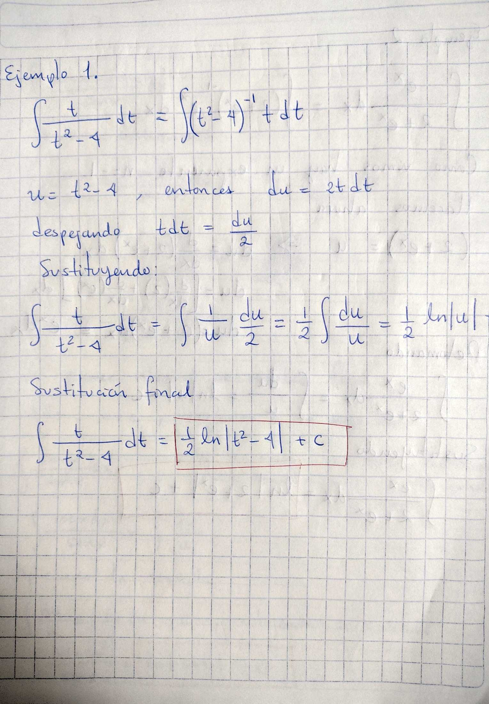
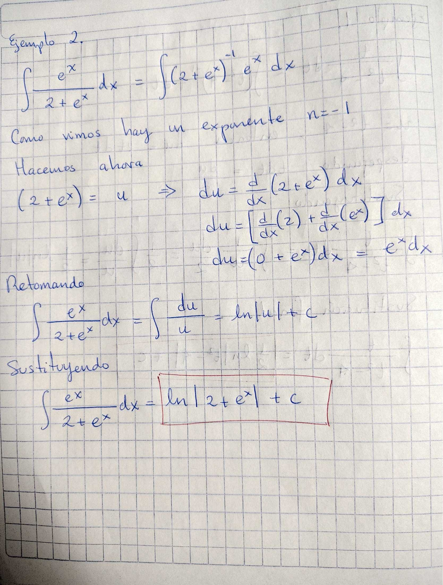
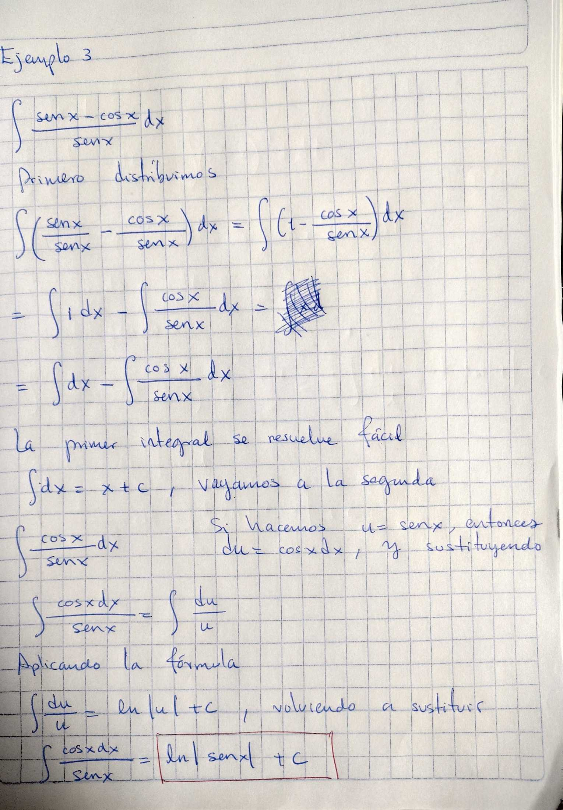

## Técnicas de Integración

Hasta ahora hemos trabajando varios ejemplos con la siguiente fórmula:
$$
{\displaystyle \int x^n dx = \frac{x^{n+1}}{n+1} + C}
$$
Esta fórmula no se debe aplicar cuando ${{n}}$ es igual a ${{-1}}$ . Para los casos en los que el valor de ${{n}}$ de la variable es ${{-1}}$, utilizamos la siguiente fórmula:
$$ \displaystyle \int \frac{dv}{v} = \ln|v| + C
$$

Y aplicamos los conocimientos algebraicos que tenemos (como leyes de los exponentes o identidades trigonométricas, según sea el caso) para transformar la expresión antes de integrar. A continuación veremos algunos [ejemplos sobre esta fórmula](#ejemplos).

---
## Ejemplos

Estos son algunos ejemplos en los que se utiliza la fórmula de integración
$$
{\displaystyle \int \frac{dv}{v} = \ln|v| + C}
$$

*Ejemplo 1*

*Ejemplo 2*

*Ejemplo 3*

---
## Ejercicios
Resolver los siguientes ejercicios:

1. $$\int \frac{x^2 + 3x - 1}{x} \, dx$$
2. 
$$\int \tan(t) \, dt$$

3. $${\displaystyle \int \frac{\csc^2{(2t)}}{1 + \cot{(2t)}}}dt$$
4. $$\displaystyle \int\frac{e^w + 2\sin w \cos w}{e ^w + \sin^2 w}dw$$